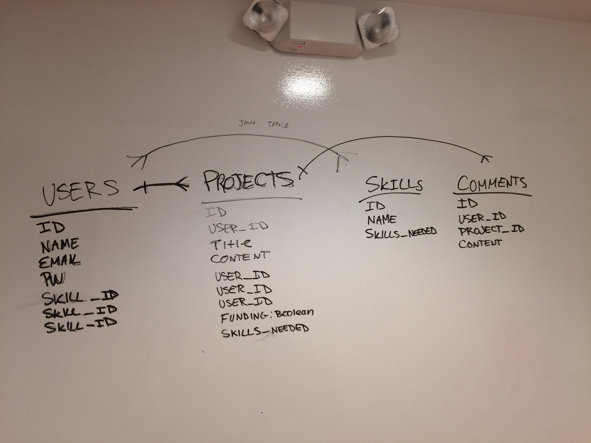

# PROJECT TWO 

###The Idea - Name is TBD
I would like to buid a site that helps connect people in the tech industry with each other. The goal is for users to find collaborators to make their projects and ideas a reality. Users will create profiles and can either post projects or search for projects that are looking for individuals with their skill set. 

####MVP
* Users can create profiles with log in and logout capabilites 
* Users can post projects they are looking for help with 
* Users can search for projects that their skill set could be an asset to. 
* Users can respond to project profiles in order to make connections with the project's creator. 

  

#####Wire Frames

#####ERD

##### User Story

[Trello Link](https://trello.com/b/w54m2jm3/project-2)
