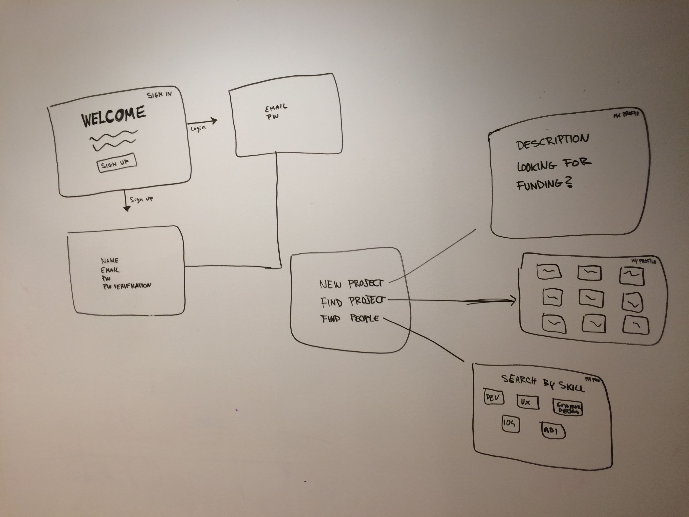
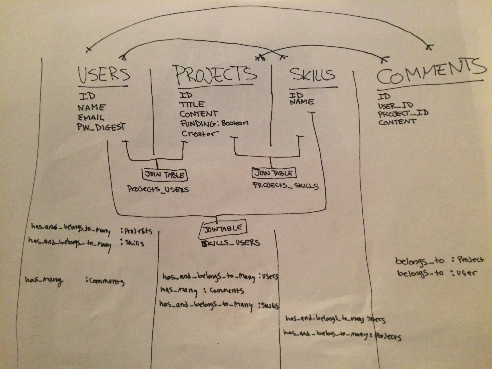

# PROJECT TWO 

###CONNECTECH
CONNECTEC is a site that helps connect people in the tech industry with each other. The goal is for users to find collaborators to make their projects and ideas a reality. Users will create profiles and can either post projects or search for projects that are looking for individuals with their skill set. 

####MVP
* Users can create profiles with log in and logout capabilites 
* Users can post projects they are looking for help with 
* Users can search for projects that their skill set could be an asset to. 
* Users can respond to project profiles in order to make connections with the project's creator. 

#####Approach Taken
I used Ruby on Rails to build this application and bootstrap was used to help with styling. I made 4 models and 3 join tables to set up the database. Once I had my models and join tables set up properly, I was able to build the necessary RESTful routes and set up CRUD functionality to fit the purposes of my site.  

#####Technologies Used
* HTML
* Ruby on Rails
* Bootstrap/SCSS
* Git
* Github
* Heroku

#####Installation Instructions 

##### Known Bugs
* I have not styled all of the pages that I want to - lots of styling issues.
* Projects cannot yet be edited.
* You cannot search for users based on skill set yet.

#####Wire Frames

#####ERD

##### User Story

[Trello Link](https://trello.com/b/w54m2jm3/project-2)
